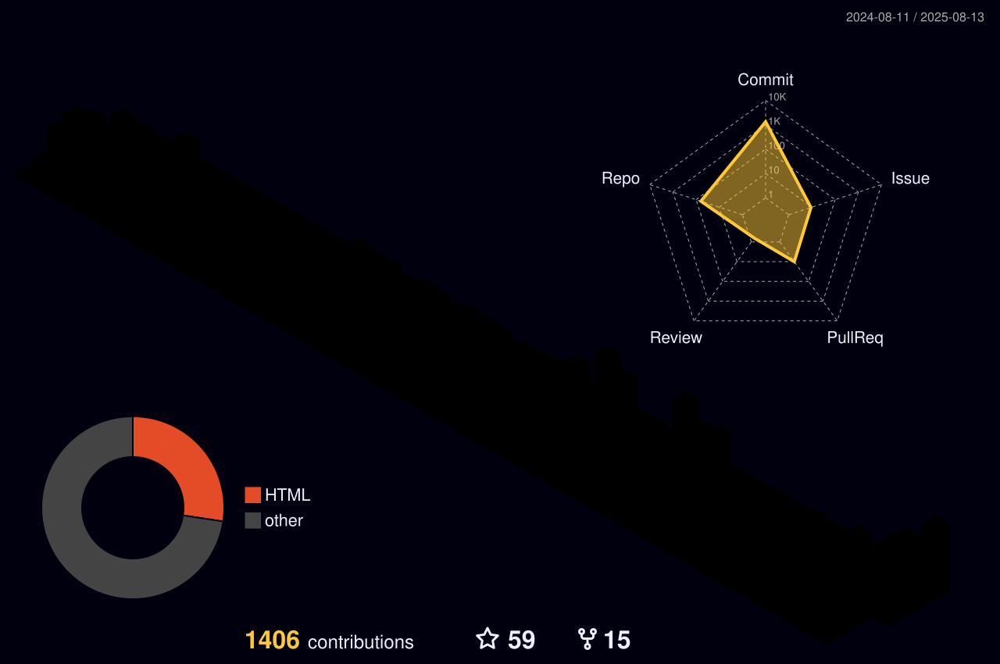

<p align="center">
  <a href="https://github.com/hosseinit1988">
    
  </a>
</p>

<div align="center">
  
</div>

<picture>
  <source media="(prefers-color-scheme: dark)" srcset="https://raw.githubusercontent.com/Nazky/Nazky/output/pacman-contribution-graph-dark.svg">
  <source media="(prefers-color-scheme: light)" srcset="https://raw.githubusercontent.com/Nazky/Nazky/output/pacman-contribution-graph.svg">
  
</picture>

---

## 👨‍💻 About Me

- ❤️ I love building tools with **TypeScript**, **Shell**, **Python**, **Go** and modern web technologies
- 🖥️ **Web Designer | SQL Administrator | Network Security | Linux Developer**
- 🌐 Building tools around **DNS, Networking, Tunnels, Proxy Systems & Linux**
- 🐧 Linux enthusiast and server administrator
- ☁️ Working with cloud and dedicated servers
- 🔧 Interested in automation, infrastructure, networking and security
- 💬 Ask me about anything [here](https://github.com/hosseinit1988/hosseinit1988/issues)

<p align="center">
  <a href="https://github.com/hosseinit1988?tab=repositories">
    
  </a>
</p>

---

## 🛠️ Languages & Tools

<p align="center">
  
  <br/>
  
</p>

<p align="center">
  
  
  
  
  
  
</p>

---

## 🚀 Recently Updated Projects

> Projects below are ordered by their latest repository activity.

| Project | Description | Stack | Last Update |
|:---|:---|:---:|:---:|
| [**easy-dnstt-tunnel**](https://github.com/hosseinit1988/easy-dnstt-tunnel) | ⚡ Automated DNSTT DNS Tunnel + 3x-ui setup for Ubuntu/Debian with VLESS, TLS, WebSocket, Let's Encrypt and firewall configuration |  | **Aug 21, 2026** |
| [**DNS-Master-Pro**](https://github.com/hosseinit1988/DNS-Master-Pro) | 🚀 Advanced DNS Manager with 30+ DNS providers, DoT, custom DNS and Systemd-Resolved support |  | **Aug 18, 2026** |
| [**Ubuntu-Repository-iran**](https://github.com/hosseinit1988/Ubuntu-Repository-iran) | 🇮🇷 تنظیم بهترین Mirror برای مخازن Ubuntu جهت استفاده روی سرورهای ایران |  | **Aug 18, 2026** |
| [**BackPack**](https://github.com/hosseinit1988/BackPack) | 🚀 High-performance reverse tunnel engine for Edge ↔ Origin server environments |  | **Aug 6, 2026** |
| [**Wp-HiTPersianDate**](https://github.com/hosseinit1988/Wp-HiTPersianDate) | 🇮🇷 Persian date plugin for WordPress themes and settings with Persian font support |  | **Aug 2, 2026** |
| [**X4G**](https://github.com/hosseinit1988/X4G) | ⚡ High-performance networking and tunnel project |  | **Jul 10, 2026** |
| [**hosseinit1988.github.io**](https://github.com/hosseinit1988/hosseinit1988.github.io) | ☁️ Web-based Cloudflare & Fastly scanner |  | **Jun 7, 2026** |
| [**Excel-Worksheet-Password-Remover**](https://github.com/hosseinit1988/Excel-Worksheet-Password-Remover) | 🔓 Excel worksheet password remover for XLS/XLSX files |  | **Jun 6, 2026** |
| [**configv2ray**](https://github.com/hosseinit1988/configv2ray) | 🌐 Collection and management of V2Ray configurations from trusted sources |  | **Jun 1, 2026** |
| [**LightWay**](https://github.com/hosseinit1988/LightWay) | ⚡ Cloudflare Worker + Google Apps Script relay project |  | **May 25, 2026** |
| [**CFScanner-HosseinIT**](https://github.com/hosseinit1988/CFScanner-HosseinIT) | ☁️ Cloudflare scanner for collecting online IP addresses |  | **May 23, 2026** |

---

## ⭐ Featured Projects

### ⚡ easy-dnstt-tunnel

Automated DNSTT tunnel deployment for Ubuntu/Debian with integrated 3x-ui setup.

**Highlights:**

- DNS Tunnel
- VLESS
- TLS
- WebSocket
- Let's Encrypt
- Firewall configuration
- Automatic service restart
- Automated installation

👉 [View Project](https://github.com/hosseinit1988/easy-dnstt-tunnel)

---

### 🚀 DNS-Master-Pro

Advanced DNS management utility designed for modern Linux servers.

**Features:**

- 30+ DNS providers
- DNS over TLS (DoT)
- Custom DNS
- Systemd-Resolved integration
- Ubuntu 20+
- Fast DNS switching
- Server-oriented configuration

👉 [View Project](https://github.com/hosseinit1988/DNS-Master-Pro)

---

### 🇮🇷 Ubuntu-Repository-iran

A simple tool for configuring optimized Ubuntu repository mirrors for servers located in Iran.

👉 [View Project](https://github.com/hosseinit1988/Ubuntu-Repository-iran)

---

### 🚀 BackPack

High-performance reverse tunnel engine written in Go for Edge ↔ Origin server architectures.

👉 [View Project](https://github.com/hosseinit1988/BackPack)

---

## 🌐 Networking & Infrastructure

My repositories also include projects around:

- 🔐 Reverse Tunnels
- 🌐 DNS Management
- ☁️ Cloudflare
- ⚡ Fastly
- 🛰️ ICMP Tunnels
- 🔀 VXLAN
- 🔒 Proxy Infrastructure
- 🐧 Linux Server Administration
- 🚀 Network Automation
- 🛡️ Network Security
- 📡 Traffic Routing
- ⚙️ Server Management

Explore all projects:

👉 **[github.com/hosseinit1988?tab=repositories](https://github.com/hosseinit1988?tab=repositories)**

---

## 📊 GitHub Stats

<p align="center">
  
  
  
</p>

<p align="center">
  
  
  
</p>

---

## 📈 GitHub Activity

<p align="center">
  
</p>

<p align="center">
  
</p>

---

## 🧰 What I Work With

```text
Web Development
├── TypeScript
├── JavaScript
├── React
├── Next.js
├── HTML
├── CSS
├── Tailwind CSS
└── PHP

Backend & Database
├── Node.js
├── PHP
├── MySQL
├── PostgreSQL
└── Microsoft SQL Server

Linux & Infrastructure
├── Linux
├── Bash / Shell
├── Nginx
├── Cloudflare
├── Hetzner
├── DNS
└── System Administration

Networking & Security
├── Reverse Tunnels
├── ICMP
├── VXLAN
├── DNS Tunneling
├── Proxy Systems
├── Traffic Routing
└── Network Security
```

---

## 📂 More Projects

Some of my other repositories include:

- [Nova-Proxy](https://github.com/hosseinit1988/Nova-Proxy)
- [personal-portfolio-nextjs](https://github.com/hosseinit1988/personal-portfolio-nextjs)
- [ICMP-Tunnel-Ubuntu](https://github.com/hosseinit1988/ICMP-Tunnel-Ubuntu)
- [ICMP.Tunnel.Ubuntu](https://github.com/hosseinit1988/ICMP.Tunnel.Ubuntu)
- [portfolio-template-html-css-java](https://github.com/hosseinit1988/portfolio-template-html-css-java)
- [portfolio-template](https://github.com/hosseinit1988/portfolio-template)
- [walpanel](https://github.com/hosseinit1988/walpanel)
- [ITunnel](https://github.com/hosseinit1988/ITunnel)
- [RGT](https://github.com/hosseinit1988/RGT)
- [Backhaul](https://github.com/hosseinit1988/Backhaul)
- [FRPulse](https://github.com/hosseinit1988/FRPulse)
- [Hossein.IT-PDF-Editor](https://github.com/hosseinit1988/Hossein.IT-PDF-Editor)
- [HosseinIT.Tunnel](https://github.com/hosseinit1988/HosseinIT.Tunnel)
- [dns-switcher](https://github.com/hosseinit1988/dns-switcher)
- [syshelper](https://github.com/hosseinit1988/syshelper)
- [TrustTunnel](https://github.com/hosseinit1988/TrustTunnel)
- [ICMPTunnel](https://github.com/hosseinit1988/ICMPTunnel)
- [v2ray-assistance](https://github.com/hosseinit1988/v2ray-assistance)

👉 [View all 42 repositories](https://github.com/hosseinit1988?tab=repositories)

---

## 🔗 Connect With Me

<p align="center">
  <a href="https://github.com/hosseinit1988">
    
  </a>
  <a href="https://1itman.ir">
    
  </a>
  <a href="https://x.com/Hossein_iritp">
    
  </a>
  <a href="https://instagram.com/tinyhouse.iran">
    
  </a>
</p>

---

<div align="center">

### 💻 Code. Build. Automate. Repeat.

**Thanks for visiting my profile!**

⭐ If you find my projects useful, consider giving them a star.

</div>

---

<p align="center">
  
</p>

<p align="center">
  ⭐️ From <a href="https://github.com/hosseinit1988">hosseinit1988</a>
</p>
